# NeuroSpark Core

An autonomous agentic learning platform—a "school" of specialised Agents that continuously scout trusted sources, vectorise fresh knowledge, teach humans (or downstream AIs), and never contaminate themselves with hallucinations.

[](https://opensource.org/licenses/MIT)
[](https://www.python.org/downloads/)
[](https://fastapi.tiangolo.com/)
[](https://www.docker.com/)
[](https://en.wikipedia.org/wiki/Test-driven_development)
[](https://coverage.readthedocs.io/)
[](https://docs.pydantic.dev/)

## Project Overview

NeuroSpark Core is a distributed system of specialized agents that work together to:
1. Discover and collect knowledge from trusted sources
2. Process and vectorize this knowledge
3. Create lessons and answers with proper citations
4. Validate content for factual accuracy
5. Deliver knowledge to users through conversational interfaces
6. Monitor system performance and quality

The platform is designed to be:
- **Factual**: All content is grounded in trusted sources with citations
- **Autonomous**: Agents work together with minimal human intervention
- **Scalable**: Modular architecture allows for horizontal scaling
- **Extensible**: Easy to add new agents, data sources, and capabilities

## Architecture

### Agent Framework

The core of NeuroSpark is our agent framework, which provides a robust foundation for building autonomous, communicating agents. The framework has been implemented with a focus on reliability, testability, and extensibility.

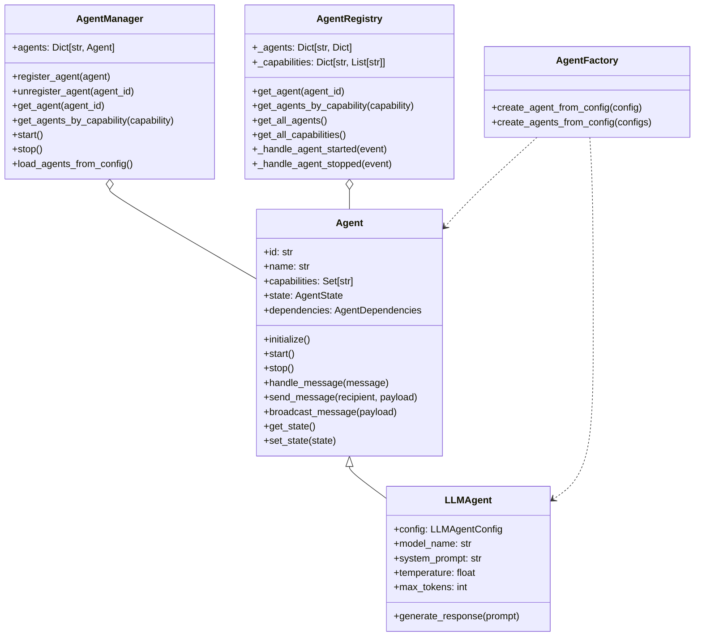

### System Architecture

The system consists of the following agents, with the base framework now implemented:

| Agent | Core Responsibility | Consumes | Emits | Status |
|-------|--------------------|----------|-------|--------|
| **Curator** | Discover docs (OpenAlex, NewsAPI, SerpAPI) | keywords, RSS | raw docs | Planned |
| **Vectoriser** | Clean ➜ chunk ➜ embed | raw docs | vectors (Qdrant) | Planned |
| **Professor** | Draft lessons / answers with citations | vectors | markdown drafts | Planned |
| **Reviewer** | Validates each draft's citations via RAG similarity & factuality | drafts | `approve` / `regenerate` | Planned |
| **Tutor** | Converse with users, track mastery | approved lessons | chat msgs | Planned |
| **Auditor** | Spot‑check global metrics: relevance, cost, latency | any outputs | audit reports | Planned |
| **Custodian** | De‑dupe vectors, prune stale/low‑score chunks, rebuild indexes | Qdrant metadata | pruned IDs | Planned |
| **Governor** | Enforce MCP rate‑limits, per‑Agent budgets | cost events | throttle cmds | Planned |

### Agent Interactions and Workflows

The NeuroSpark system is designed around agent interactions that form complete workflows. Each agent has specific responsibilities and communicates with other agents through the message bus.

#### Message Flow

The following diagram illustrates how messages flow between agents in the system:

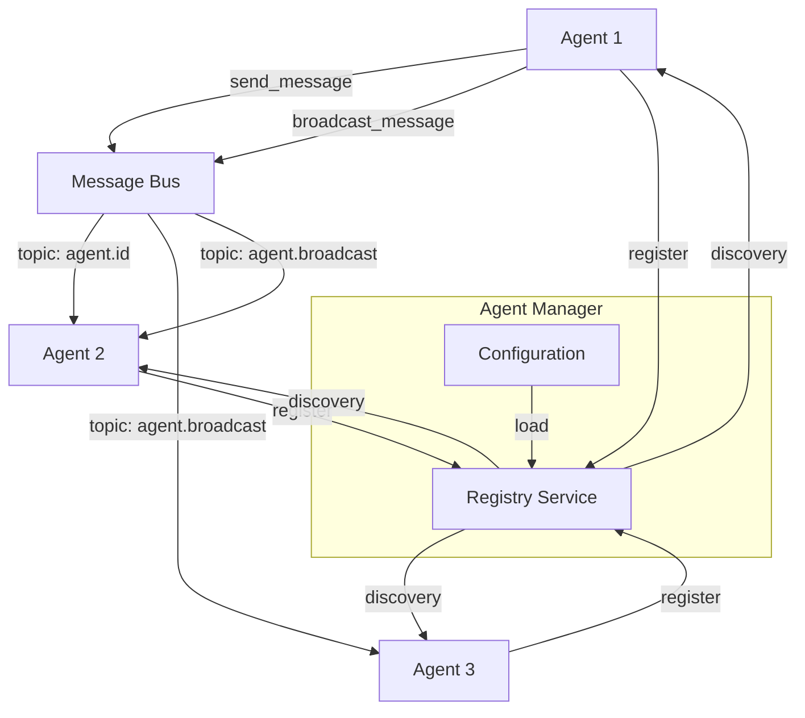

#### Complete Knowledge Workflow

This diagram shows the complete workflow from knowledge discovery to user interaction:

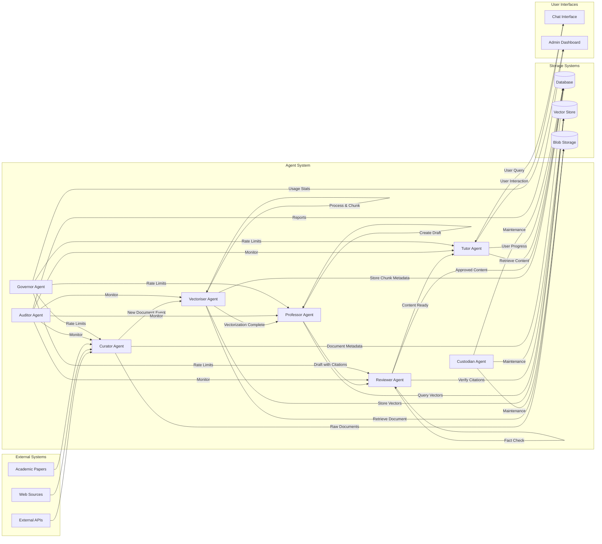

#### Agent Interaction Patterns

Agents in NeuroSpark interact using several patterns:

1. **Direct Communication**: An agent sends a message directly to another agent using its ID
   ```python
   await agent.send_message("agent-id", {"action": "process", "data": {...}})
   ```

2. **Broadcast Communication**: An agent sends a message to all agents
   ```python
   await agent.broadcast_message({"action": "system-update", "data": {...}})
   ```

3. **Capability-based Routing**: An agent discovers other agents by capability and sends messages
   ```python
   agents = await registry.get_agents_by_capability("document-processing")
   for agent in agents:
       await self.send_message(agent["id"], {"action": "process", "data": {...}})
   ```

4. **Event-driven Processing**: Agents subscribe to topics and react to events
   ```python
   # In handle_message method
   if message.type == "document-ready":
       await self.process_document(message.payload["document_id"])
   ```

5. **State-based Coordination**: Agents maintain state and coordinate based on state changes
   ```python
   # Update agent state
   await self.set_state({"processing": True, "document_id": doc_id})

   # Other agents can check state
   state = await agent.get_state()
   if state["processing"]:
       # Wait or take alternative action
   ```

### Enhanced Agent Communication System

NeuroSpark features an advanced bidirectional communication system that enables agents to express needs, provide feedback, and collaborate effectively. This system is built on top of the base agent framework and provides specialized message types and handlers for complex agent interactions.

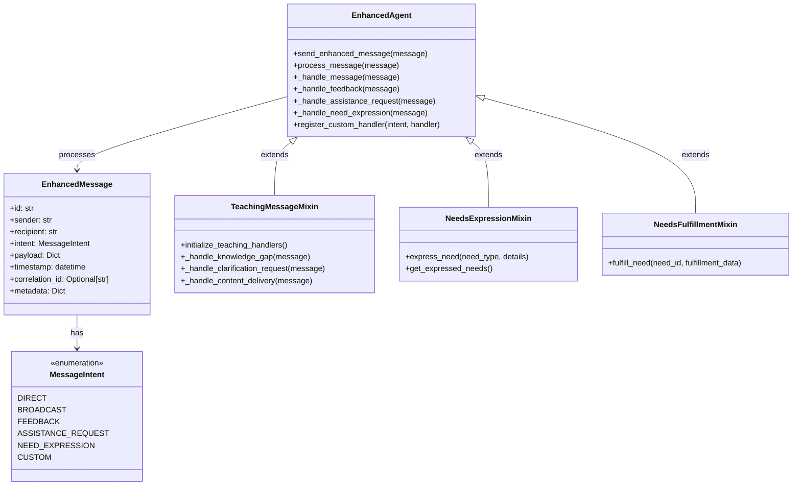

#### Key Features

1. **Intent-based Messaging**: Messages are categorized by intent, allowing for specialized handling
   ```python
   message = MessageFactory.create_direct_message(
       sender=self.id,
       recipient="agent-id",
       payload={"content": "Hello!"},
       intent=MessageIntent.DIRECT
   )
   await self.send_enhanced_message(message)
   ```

2. **Feedback Mechanism**: Agents can provide feedback on messages or actions
   ```python
   feedback = MessageFactory.create_feedback_message(
       sender=self.id,
       recipient="agent-id",
       about_message_id="message-123",
       feedback_data={"quality": "excellent", "suggestions": ["Add more examples"]}
   )
   await self.send_enhanced_message(feedback)
   ```

3. **Needs Expression Protocol**: Agents can express needs and have them fulfilled by other agents
   ```python
   # Agent expressing a need
   await self.needs_protocol.express_need(
       need_type="information",
       details={"topic": "machine learning", "urgency": "high"}
   )

   # Another agent fulfilling the need
   await self.needs_protocol.fulfill_need(
       need_id="need-123",
       fulfillment_data={"content": "Here's information about machine learning..."}
   )
   ```

4. **Teaching Patterns**: Specialized communication patterns for educational interactions
   ```python
   # Tutor identifying a knowledge gap
   await self.teaching_patterns.identify_knowledge_gap(
       user_id="student123",
       topic="machine learning",
       context={"difficulty": "intermediate"}
   )

   # Professor responding with content
   await self.send_enhanced_message(
       MessageFactory.create_direct_message(
           sender=self.id,
           recipient="tutor-agent",
           payload={"content": "Detailed explanation of machine learning..."},
           intent=TeachingIntent.CONTENT_DELIVERY
       )
   )
   ```

5. **Custom Message Handlers**: Register handlers for custom message intents
   ```python
   # Register a custom handler
   self.register_custom_handler(
       "CUSTOM_INTENT",
       self._handle_custom_message
   )

   # Define the handler
   async def _handle_custom_message(self, message):
       # Process the custom message
       pass
   ```

#### Using the Enhanced Agent Communication System

To use the enhanced agent communication system in your agents:

1. **Extend the EnhancedAgent class**:
   ```python
   class MyAgent(EnhancedAgent):
       def __init__(self, agent_id, name, dependencies):
           super().__init__(agent_id, name, dependencies)
   ```

2. **Add specialized mixins for specific capabilities**:
   ```python
   class MyTeachingAgent(EnhancedAgent, TeachingMessageMixin):
       def __init__(self, agent_id, name, dependencies):
           super().__init__(agent_id, name, dependencies)
           # Initialize teaching patterns
           self.teaching_patterns = TeachingPatterns(self)
   ```

3. **Initialize message handlers**:
   ```python
   async def initialize(self):
       await super().initialize()
       # For teaching agents
       await self.initialize_teaching_handlers()
   ```

4. **Implement custom message handlers**:
   ```python
   async def _handle_content_delivery(self, message):
       # Process content delivery message
       content = message.payload.get("content")
       # Use the content...
   ```

5. **Send enhanced messages**:
   ```python
   response = MessageFactory.create_direct_message(
       sender=self.id,
       recipient=message.sender,
       payload={"answer": "The answer to your question is..."},
       intent="CLARIFICATION_RESPONSE",
       correlation_id=message.id
   )
   await self.send_enhanced_message(response)
   ```

#### Demo Scripts

The repository includes two demo scripts to demonstrate the enhanced agent communication system:

1. **Simple Demo** (`examples/agent_communication_demo.py`): Demonstrates the basic functionality using a mock message bus
   ```bash
   python examples/agent_communication_demo.py
   ```

2. **End-to-End Demo** (`examples/e2e_agent_communication.py`): Shows a complete example using Redis in Docker
   ```bash
   python examples/e2e_agent_communication.py
   ```

These demos showcase how agents can identify knowledge gaps, request clarifications, deliver content, and provide feedback in a bidirectional communication flow.

## Tech Stack

| Layer | Choice | Why / Escape Hatch | Status |
|-------|--------|--------------------|--------|
| **Agent Framework** | Custom Pydantic-based framework | Type safety, extensibility, async-first | **Implemented** ✅ |
| **API Surface** | FastAPI + gRPC (`grpclib`) | Python ecosystem, language‑agnostic micro‑services | Partially Implemented |
| **Vector Search** | **Llama‑Index router** → Qdrant (ANN) *+* ElasticLite (BM25) | Hybrid recall; swap ElasticLite for OpenSearch if needed | **Implemented** ✅ |
| **Metadata DB** | Postgres 16 | ACID, easy local dev | **Implemented** ✅ |
| **Blob Store** | MinIO (S3‑compat) | Single‑binary, Docker‑friendly | **Implemented** ✅ |
| **Message Bus** | Redis Streams → migrate to NATS when clustered | Zero config on day 0 | **Implemented** ✅ |
| **Scraping** | trafilatura (HTML) • pdfminer‑s (PDF) | Stable, Unicode‑safe | Planned |
| **LLM Provider** | OpenAI `gpt‑4o` (env `OPENAI_API_KEY`) | Can switch to local Llama‑3‑GGUF | **Implemented** ✅ |
| **Paper / Web APIs** | OpenAlex (scholarly) • NewsAPI • SerpAPI | All have Python SDKs | Planned |

### Current Implementation Status

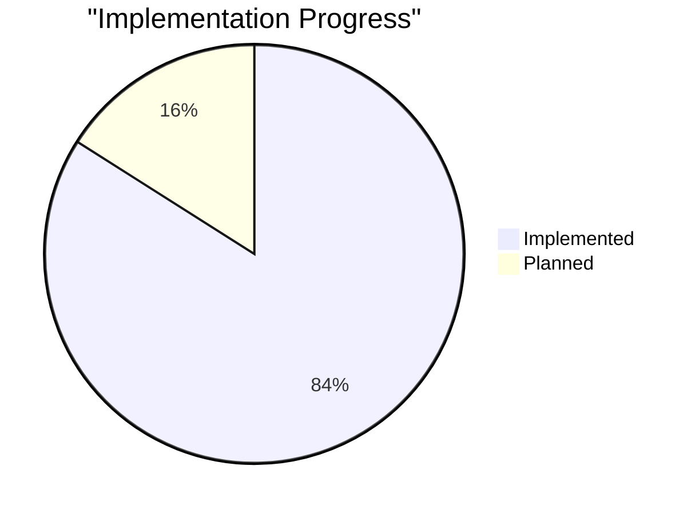

The following components have been fully implemented and tested:

1. **Agent Framework**: The core agent framework with base Agent class, LLMAgent, AgentManager, AgentRegistry, and AgentFactory.
2. **Enhanced Agent Communication**: Bidirectional communication system with specialized message types and handlers.
3. **Teaching Patterns**: Communication patterns for educational interactions between agents.
4. **Needs Expression Protocol**: System for agents to express needs and have them fulfilled by other agents.
5. **Message Bus**: Redis Streams-based message bus for agent communication.
6. **Vector Store**: Qdrant integration for vector storage and retrieval.
7. **Database**: PostgreSQL integration with SQLAlchemy ORM.
8. **Storage**: MinIO integration for blob storage.
9. **Search**: ElasticSearch integration for text search.
10. **Configuration**: Environment-based configuration with Pydantic models.
11. **Health Checks**: Health check system for monitoring service status.

## Agent Configuration and Deployment

NeuroSpark agents are configured using JSON configuration files, which define their properties, capabilities, and behavior.

### Configuration Format

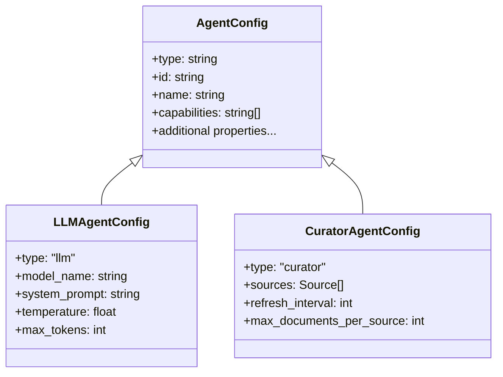

### Example Configuration

```json
[
  {
    "type": "llm",
    "id": "professor-agent",
    "name": "Professor",
    "capabilities": ["create-lessons", "answer-questions"],
    "model_name": "gpt-4o",
    "system_prompt": "You are a professor who creates educational content with proper citations.",
    "temperature": 0.7,
    "max_tokens": 2000
  },
  {
    "type": "curator",
    "id": "curator-agent",
    "name": "Curator",
    "capabilities": ["discover-documents"],
    "sources": [
      {
        "type": "openalex",
        "filters": {
          "topics": ["machine learning", "artificial intelligence"],
          "date_range": "last_month"
        }
      },
      {
        "type": "newsapi",
        "filters": {
          "topics": ["technology", "science"],
          "date_range": "last_week"
        }
      }
    ],
    "refresh_interval": 3600,
    "max_documents_per_source": 50
  }
]
```

### Loading and Deploying Agents

Agents are loaded and deployed by the `AgentManager` at system startup:

```python
# Load agent configurations
with open("config/agents.json", "r") as f:
    agent_configs = json.load(f)

# Create agent factory
agent_factory = AgentFactory(settings, message_bus)

# Create agents from configurations
agents = agent_factory.create_agents_from_config(agent_configs)

# Register agents with the manager
for agent in agents:
    await agent_manager.register_agent(agent)

# Start the agent manager
await agent_manager.start()
```

## Quick Start

### Prerequisites

- [Docker](https://docs.docker.com/get-docker/) and [Docker Compose](https://docs.docker.com/compose/install/)
- [Python 3.11+](https://www.python.org/downloads/)
- [Make](https://www.gnu.org/software/make/)

### Installation

```bash
# Clone the repository
git clone https://github.com/JtPerez-Acle/neurospark-core.git
cd neurospark-core

# Create a virtual environment (optional but recommended)
python -m venv venv
source venv/bin/activate  # On Windows: venv\Scripts\activate

# Install development dependencies
pip install -e ".[dev]"

# Copy example environment file and add your API keys
cp .env.example .env

# Edit the .env file to add your API keys
# Required: OPENAI_API_KEY for LLM functionality
# Optional: OPENALEX_API_KEY, NEWSAPI_API_KEY, SERPAPI_API_KEY for external data sources
```

### Running the Platform

```bash
# Start all services with Docker Compose
make dev

# Check the status of all services
docker-compose ps

# View logs for a specific service
make logs-api  # Replace 'api' with any service name

# Run tests to verify setup
make test

# Stop all services
make down
```

### API Documentation

Once the services are running, you can access the API documentation at:

- Swagger UI: http://localhost:8000/docs
- ReDoc: http://localhost:8000/redoc

### Monitoring

- Grafana Dashboard: http://localhost:3000 (admin/admin)
- Prometheus: http://localhost:9090

## Agent Framework Implementation

The agent framework is the core of NeuroSpark, providing a foundation for building autonomous, communicating agents. Here's a detailed look at the implementation:

### Agent Base Class

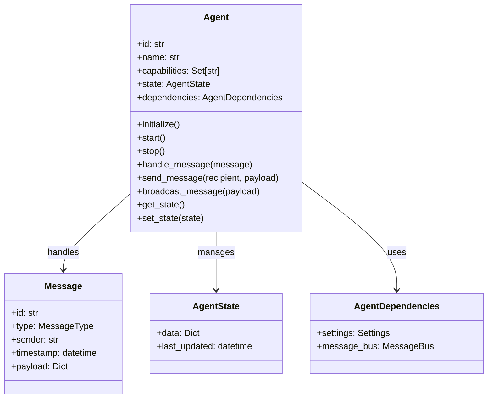

The `Agent` base class provides:

1. **Lifecycle Management**: Methods for initialization, starting, and stopping agents
2. **Message Handling**: Processing incoming messages and sending messages to other agents
3. **State Management**: Storing and retrieving agent state
4. **Service Discovery**: Finding other agents by ID or capability

### LLM Agent

The `LLMAgent` class extends the base `Agent` class to provide LLM-powered capabilities:

```python
class LLMAgent(Agent):
    """An agent that uses an LLM to generate responses."""

    def __init__(
        self,
        agent_id: str,
        name: str,
        dependencies: AgentDependencies,
        capabilities: Optional[List[str]] = None,
        config: Optional[LLMAgentConfig] = None,
    ):
        super().__init__(agent_id, name, dependencies, capabilities)
        self.config = config or LLMAgentConfig()

    async def generate_response(self, prompt: str) -> str:
        """Generate a response using the LLM."""
        # Implementation depends on the LLM provider
        pass
```

### Agent Manager

The `AgentManager` class manages the lifecycle of agents and provides service discovery:

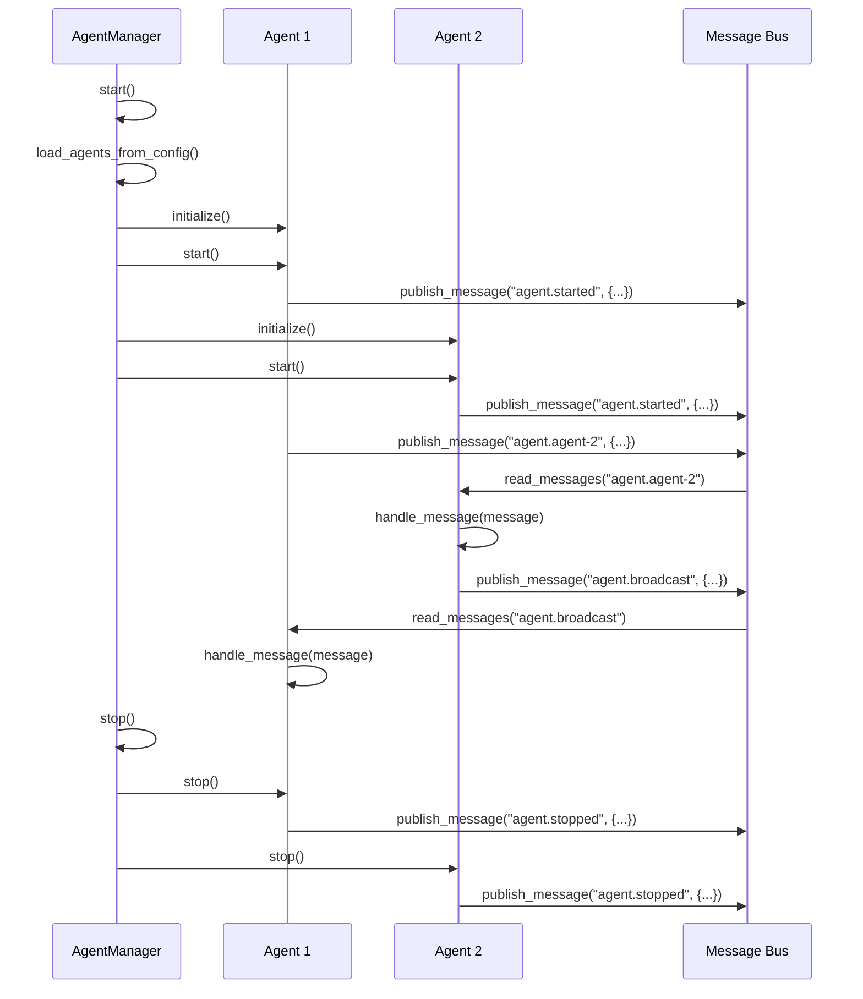

### Agent Registry

The `AgentRegistry` class provides service discovery for agents:

```python
class AgentRegistry:
    """Registry for agent discovery."""

    def __init__(self, settings: Settings, message_bus: MessageBus):
        self.settings = settings
        self.message_bus = message_bus
        self._agents = {}  # agent_id -> agent_info
        self._capabilities = {}  # capability -> [agent_id]
        self._running = False
        self._task = None

    async def get_agent(self, agent_id: str) -> Optional[Dict[str, Any]]:
        """Get agent by ID."""
        return self._agents.get(agent_id)

    async def get_agents_by_capability(self, capability: str) -> List[Dict[str, Any]]:
        """Get agents by capability."""
        agent_ids = self._capabilities.get(capability, [])
        return [self._agents[agent_id] for agent_id in agent_ids if agent_id in self._agents]
```

### Agent Factory

The `AgentFactory` class creates agents from configuration, serving as the central point for instantiating different agent types in the system.

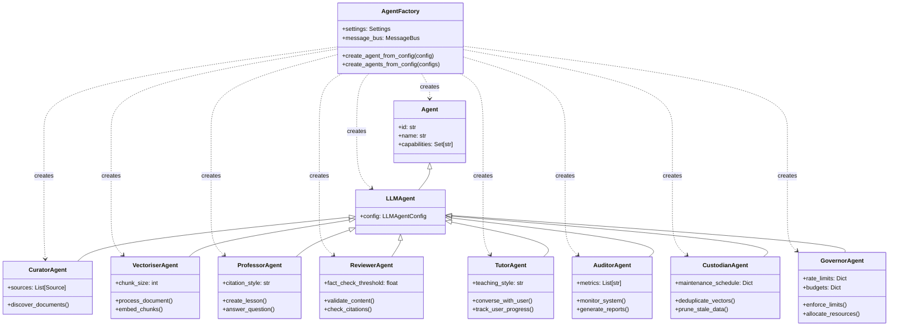

The factory pattern allows us to:
1. Create agents from configuration files or API requests
2. Inject dependencies consistently across all agent types
3. Extend the system with new agent types without modifying existing code
4. Standardize agent creation throughout the application

#### Agent Creation Process

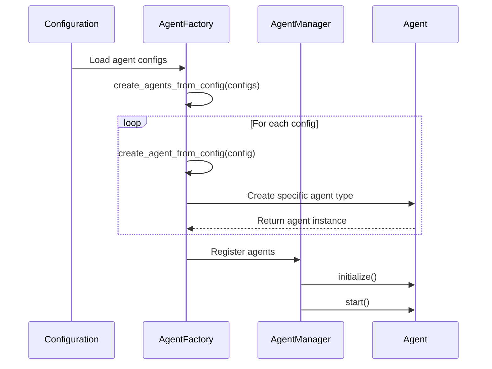

#### Implementation

```python
class AgentFactory:
    """Factory for creating agents from configuration."""

    def __init__(self, settings: Settings, message_bus: MessageBus):
        self.settings = settings
        self.message_bus = message_bus

    def create_agent_from_config(self, config: Dict[str, Any]) -> Agent:
        """Create an agent from a configuration dictionary."""
        agent_type = config.get("type", "base")
        agent_id = config.get("id")
        name = config.get("name", agent_id)
        capabilities = config.get("capabilities", [])

        dependencies = AgentDependencies(
            settings=self.settings,
            message_bus=self.message_bus,
        )

        # Create the appropriate agent type based on configuration
        if agent_type == "llm":
            return LLMAgent(
                agent_id=agent_id,
                name=name,
                dependencies=dependencies,
                capabilities=capabilities,
                config=LLMAgentConfig(**config),
            )
        elif agent_type == "curator":
            return CuratorAgent(
                agent_id=agent_id,
                name=name,
                dependencies=dependencies,
                capabilities=capabilities,
                config=CuratorAgentConfig(**config),
            )
        # Additional agent types will be added here
        else:
            return Agent(
                agent_id=agent_id,
                name=name,
                dependencies=dependencies,
                capabilities=capabilities,
            )
```

## Development

This project follows Test-Driven Development principles. All new features must include tests.

### Project Structure

```
neurospark-core/
├── src/
│   ├── api/                # FastAPI and gRPC API definitions
│   ├── agents/             # Agent implementations
│   │   ├── base.py         # Base Agent class
│   │   ├── factory.py      # Agent factory
│   │   ├── llm_agent.py    # LLM-powered agent
│   │   ├── manager.py      # Agent lifecycle management
│   │   ├── service_discovery.py # Agent registry
│   │   ├── curator/        # Discovers documents from trusted sources
│   │   ├── vectoriser/     # Processes and embeds documents
│   │   ├── professor/      # Creates draft lessons and answers
│   │   ├── reviewer/       # Validates content for factuality
│   │   ├── tutor/          # Interfaces with users
│   │   ├── auditor/        # Monitors system metrics
│   │   ├── custodian/      # Maintains vector database
│   │   └── governor/       # Enforces resource limits
│   ├── database/           # Database models and connections
│   ├── vector_store/       # Vector database interface
│   ├── search/             # Search functionality
│   ├── storage/            # Blob storage interface
│   ├── message_bus/        # Message bus for inter-agent communication
│   └── common/             # Shared utilities and models
├── tests/                  # Test suite
│   ├── e2e/                # End-to-end tests
│   ├── integration/        # Integration tests
│   ├── performance/        # Performance tests
│   ├── security/           # Security tests
│   ├── test_agents/        # Agent framework tests
│   └── mocks/              # Mock implementations for testing
├── docker/                 # Docker configuration
├── docs/                   # Documentation
├── scripts/                # Utility scripts
├── .env.example            # Example environment variables
├── docker-compose.yml      # Service orchestration
├── Makefile                # Common commands
└── README.md               # This file
```

## Testing

We follow Test-Driven Development (TDD) principles and have achieved 84% test coverage across the codebase. All tests are located in the `tests/` directory.

### Test Categories

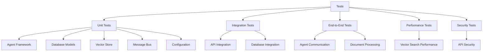

### Test Coverage

| Component | Coverage | Notes |
|-----------|----------|-------|
| **Agent Framework** | 91% | Base Agent class |
| **Enhanced Agent** | 54% | Enhanced communication system |
| **Needs Protocol** | 88% | Needs expression and fulfillment |
| **Teaching Patterns** | 73% | Educational interaction patterns |
| **Agent Factory** | 95% | Agent creation from config |
| **Agent Manager** | 86% | Agent lifecycle management |
| **Agent Registry** | 86% | Service discovery |
| **LLM Agent** | 43% | LLM integration (partial) |
| **Message Bus** | 52% | Redis Streams integration |
| **Database Models** | 100% | SQLAlchemy ORM models |
| **Vector Store** | 100% | Qdrant integration |
| **Search** | 100% | ElasticSearch integration |
| **Storage** | 75% | MinIO integration |
| **Configuration** | 99% | Environment-based config |
| **Health Checks** | 90% | Service health monitoring |

### Running Tests

```bash
# Run all tests
make test

# Run a specific test
make test-api  # Runs tests/test_api.py

# Run tests with coverage report
pytest --cov=src tests/

# Run specific test categories
pytest tests/test_agents/  # Run agent framework tests
pytest tests/e2e/  # Run end-to-end tests
pytest tests/integration/  # Run integration tests
```

### Test Implementation

We've implemented comprehensive tests for our agent framework:

1. **Unit Tests**: Testing individual components in isolation
   - Agent class functionality
   - Agent factory for creating agents from configuration
   - Agent manager for lifecycle management
   - Agent registry for service discovery

2. **Integration Tests**: Testing component interactions
   - Database integration with SQLAlchemy
   - API integration with FastAPI

3. **End-to-End Tests**: Testing complete workflows
   - Agent-to-agent communication
   - Broadcast messaging
   - State management

4. **Mock Implementations**: For testing without external dependencies
   - Mock Redis client for message bus testing
   - Mock LLM provider for agent testing

## Common Issues and Troubleshooting

### Docker Services Not Starting

If you encounter issues with Docker services not starting:

```bash
# Check service logs
docker-compose logs <service-name>

# Rebuild a specific service
docker-compose build --no-cache <service-name>

# Reset all containers and volumes (WARNING: This will delete all data)
docker-compose down -v
make dev
```

### API Key Issues

If you encounter issues with API keys:

1. Ensure your `.env` file contains the required API keys
2. Check that the API keys are valid and have the necessary permissions
3. For OpenAI, verify your account has sufficient credits

### Database Connection Issues

If you encounter database connection issues:

1. Ensure the Postgres service is running: `docker-compose ps postgres`
2. Check Postgres logs: `docker-compose logs postgres`
3. Verify database credentials in `.env` match those in `docker-compose.yml`

## Roadmap

The following diagram illustrates our development roadmap:

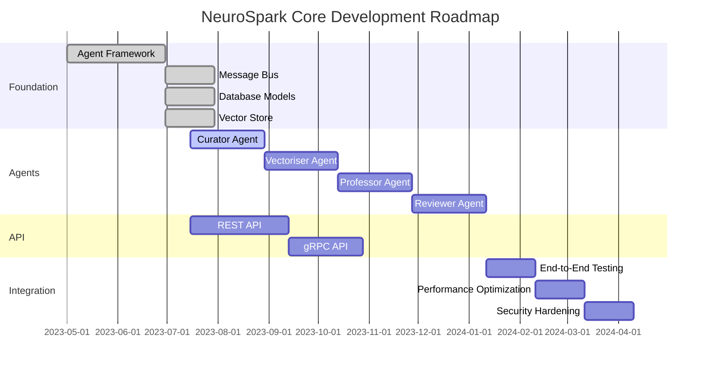

### Next Steps

1. **Complete Agent Implementations**:
   - Implement the Curator agent for discovering documents
   - Implement the Vectoriser agent for processing documents
   - Implement the Professor agent for creating lessons
   - Implement the Reviewer agent for validating content

2. **API Development**:
   - Complete the REST API for user interaction
   - Implement the gRPC API for inter-service communication

3. **Integration and Testing**:
   - Implement end-to-end workflows
   - Optimize performance for production use
   - Enhance security measures

4. **Documentation and Examples**:
   - Create comprehensive documentation
   - Provide example configurations and use cases

## Contributing

We welcome contributions to NeuroSpark Core! Please follow these steps:

1. Fork the repository
2. Create a feature branch: `git checkout -b feature/your-feature-name`
3. Commit your changes: `git commit -am 'Add some feature'`
4. Push to the branch: `git push origin feature/your-feature-name`
5. Submit a pull request

Please ensure your code follows our coding standards and includes tests.

## Contributors

- [JtPerez-Acle](https://github.com/JtPerez-Acle) - Project Lead

## License

This project is licensed under the MIT License - see the [LICENSE](LICENSE) file for details.
